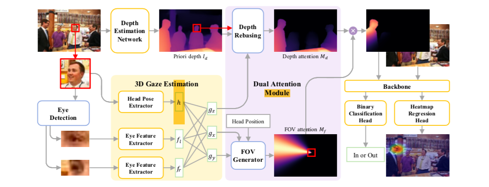

# Dual-Attention-Guided-Gaze-Target-Detection-in-the-Wild

A common issue encountered while trying to localize the gaze direction of a human being with 2Dimages is the lack of understanding of the depth by the network.  However, a very promising solution hasbeen introduced to solve this problem in the article "Dual Attention Guided Gaze Target Detection in theWild" published recently (2021) in the reputed journal of IEEE/CVF Conference on Computer Visionand Pattern Recognition (CVPR). The aim of this project is to reconstruct the approach proposed in that article.

## What was available 

- Depth Estimation Network pretrained model was given [link], it receives as input the original image, and gives us as output the depth estimation map of the same image. 
    

    

## What needed to be constructed

- First, we trained the 3D Gaze Estimation Module on Gaze360 Dataset. Then we made the predictions on the Gazefollow Dataset.
- After that, we built the Module Dual Attention Module which has two main functions : Depth Rebasing and FOV Generator. We run the model on Gazefollow to obtain the Depth Attention Map and the FOV attention Map. 
- Finally, we train the Heatmap Regression Head on Gazefollow as well.
- The Binary Head Classification module couldn’t be trained because we lacked the appropriate dataset. 
    
    

## Resulted blocks

- Preprocess Image for input block, which receives as input : The original image. And as output, gives us : Eye patches, the cropped head images and the Depth Estimation map
- 3D Gaze Estimation module, which receives as input : Eye patches and cropped head images. And as output, gives us : The 3D gaze estimation [gx, gy, gz].
- Dual Attention Module,  which receives as input  : Depth Estimation maps of an image, the head pose [yaw, pitch] and the 3D Gaze Estimation [gx, gy, gz] extracted from the last block . And as output, gives us : The Depth Attention Map and the FOV attention Map. 
- Gaze Target Detection Module, which receives as input  : The Depth Attention Map and the FOV attention Map.  And as output, gives us : the Heat map regression.
